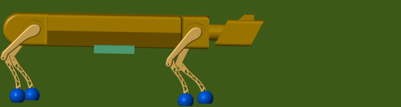

## *digital-twin-of-a-quadruped-in-simscape*
This repository contains a Simscape model of a quadrupeded robot able to 
walk on flat and inclined terrain, with a environment that presents 
different obstacles, and the posibility of open-loop or interactive control 
system.

## *Usage:*
Use Simscape 2024b version or newer to run the files

Run model from file: '/Workflows/complete_robot/complete_robot.slx'

Point cloud generation can be modified from:
'/Workflows/complete_robot/Parameters_pntcld.m'

## *Get up to speed:*
* *Tutorial 1:  Create gait('/Tutorials/01_Create_gait_depending_Bezier_curve/t01_one_leg.slx')*

    The focus of this tutorial is set on implementing the gait function for 
    one leg, that it moves realistically and is able to perform a step forward.

* *Tutorial 2: Create sideways gait('/Tutorials/02_Create_sideways_gait/t02_one_leg_sideways_movement')*

    The focus of this tutorial is set on implementing an additional sideways 
    joint in a leg, that it is able to perform a lateral step which is later 
    needed for turning and walking sideways.

* *Tutorial 3: Combine legs and torso('/Tutorials/03_Put_legs_together_to_torso_and_walk/t03_cobine_legs_to_torso')*

    This tutorial consists of building the first state of a walking four 
    legged robot, based on the leg elements and the gait functions from 
    tutorial 1 and 2.

* *Tutorial 4: Combine different gaits('/Tutorials/04_Combine_Gaits_with_if_statements/t04_combine_gaits')*

    In this tutorial several gaits need to be combined that the robot is able 
    to perform different movements, depending on the control value which acts 
    as an input.

* *Tutorial 5: Balancing('/Tutorials/05_Write_A_Code_that_balances_out/t05_balancing')*

    In this tutorial a balancing function has to be implemented to make the
    center of gravity of the robot remain in the center of the support feet
    so the robot is stable even in inclined terrain.

* *Tutorial 6: Manual control('/Tutorials/06_Manual_Control/t06_manual_control')*

    This tutorial addresses how to connect an external controller (e.g. from 
    an Xbox) and use it to manually guide the robot.

* *Tutorial 7: Open-loop control('/Tutorials/07_Open_loop_control/t07_open_loop_control')*

    This tutorial addresses some parts of the control process, from the 
    generation of the ideal path based in the occupancy grid, to the 
    sequential reading of the commands array.

## *Authors:*
Andrés Eduardo Renjifo Restrepo, Sigi Deliallisi, Leonnard Renner, Isaac
Charbel Tejeda de la Garza, Roman Podieiablonskii, Chien Yu Hua

## *Advisors:*
Andreas Apostolatos, Jan Janse van Rensburg, Steve Miller
